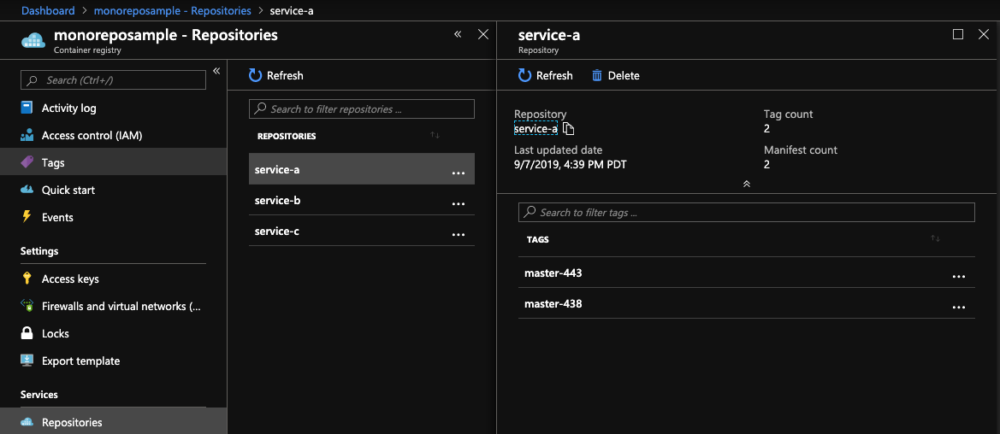

# Monorepo Example

Welcome to the Monorepo. Changes at the top level won't trigger any builds.

Each "service" builds an image and pushes to an ACR instance with the image format of `servicename:branch-buildid`

You can see the associated Azure Dev Ops Pipelines here: https://dev.azure.com/abrig/bedrock_gitops_v2/_build

## Creating ACR
<pre>
$ az group create --name <b>my-resourcegroup</b> --location eastus
$ az acr create --resource-group <b>my-resourcegroup</b> --name <b>replaceme</b> --sku Basic
</pre>

## Setting up ACR permissions
<pre>
#!/bin/bash

# Modify for your environment.
# ACR_NAME: The name of your Azure Container Registry
# SERVICE_PRINCIPAL_NAME: Must be unique within your AD tenant
ACR_NAME=<b>replaceme</b>
SERVICE_PRINCIPAL_NAME=<b>myspname</b>

# Obtain the full registry ID for subsequent command args
ACR_REGISTRY_ID=$(az acr show --name $ACR_NAME --query id --output tsv)

# Create the service principal with rights scoped to the registry.
# Default permissions are for docker pull access. Modify the '--role'
# argument value as desired:
# acrpull:     pull only
# acrpush:     push and pull
# owner:       push, pull, and assign roles
SP_PASSWD=$(az ad sp create-for-rbac --name http://$SERVICE_PRINCIPAL_NAME --scopes $ACR_REGISTRY_ID --role <b>owner</b> --query password --output tsv)
SP_APP_ID=$(az ad sp show --id http://$SERVICE_PRINCIPAL_NAME --query appId --output tsv)

# Output the service principal's credentials; use these in your services and
# applications to authenticate to the container registry.
echo "Service principal ID: $SP_APP_ID"
echo "Service principal password: $SP_PASSWD"
</pre>